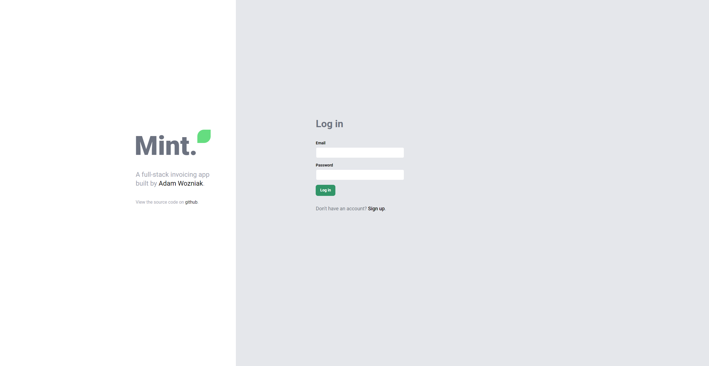
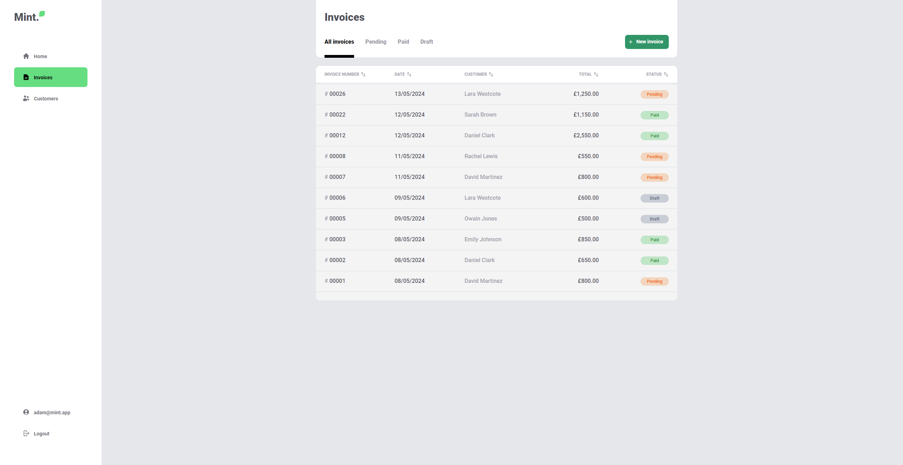

# Invoice app

A full-stack invoicing app that allows users to create customer and invoice records.

View online here: [https://mint-invoicing.onrender.com](https://mint-invoicing.onrender.com)




## Features

- User signup
- Persistant login
- CRUD features for Customers and Invoice records
- Auto-incrementing invoice numbers
- Frontend and backend form validation (saving as a draft bypasses validation)
- Filter invoices by status: 'pending', 'paid' or 'draft'
- Mark pending invoices as paid
- Automatic calculation of due date, and item and invoice totals

## About

### Frontend (`/client`)

- A SPA React app written in TypeScript, built with Vite
- Zod for form schema validation
- Tanstack Query for managing api data
- React-Router for client side routing
- JWT JSON web tokens for authorisation (access and refresh tokens)
- Axios with interceptors to manage requests and automatic token refresh

### Backend (`/server`)

- An Express API server written in TypeScript
- Zod for schema validation middleware
- Mongoose for MongoDB models
- Bcrypt for password encryption
- JSON web token for auth middleware
- Vitest, supertest, and mongo-memory-server for API testing

## Installation

- Install dependencies for both `client` and `server` directories

  ```
  cd client
  npm i

  cd ../server
  npm i
  ```

- Create a `.env` file in `/server` following the `.env.example` file
- Create a MongoDB database e.g. with MongoDB Atlas, and input the database URI to the env file
- Create random token secrets for Access and Refresh tokens and input to the env file, e.g.
  ```
  node
  require('crypto').randomBytes(64).toString('hex')
  ```

## Usage

- Run `npm run dev` in two separate terminals for both `/client` and `/server`
- See the client console to open the VITE server, (default: `localhost:5173`)

